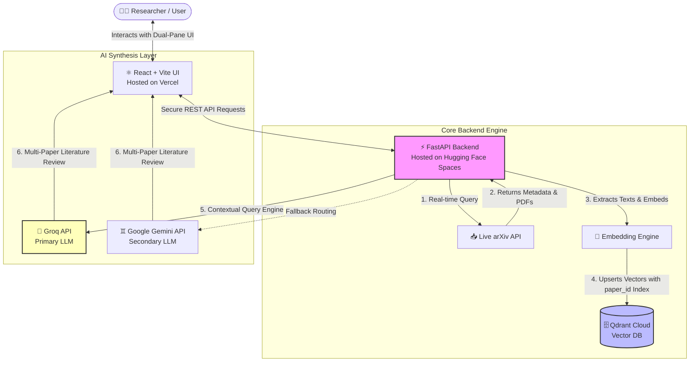

<div align="center">

# 🖧 OpenScholar

[](https://opensource.org/licenses/MIT)
[](https://www.python.org/)
[](https://fastapi.tiangolo.com/)
[](https://react.dev/)
[](https://vitejs.dev/)
[](https://tailwindcss.com/)
[](https://huggingface.co/spaces/SunbalAzizLCWU/openscholar-api)
[](https://vercel.com/)

_An intelligent, serverless, zero-cost academic research engine designed to bridge the gap between real-time scientific literature discovery and synthesis. OpenScholar dynamically pulls live papers from arXiv, vectors them on-the-fly, and generates deep synthetic literature reviews using high-throughput LLMs._
<br />

## 🚨 The Problem It Solves

Traditional academic research workflows suffer from three major bottlenecks:
1. **Information Lag:** Standard RAG (Retrieval-Augmented Generation) applications rely on static, pre-indexed vector databases that quickly become obsolete in fast-moving fields like Artificial Intelligence.
2. **Analysis Paralysis:** Reviewing literature requires downloading dozens of heavy PDFs, skimming dense academic prose, manually tracking cross-references, and synthesizing common methodologies.
3. **Infrastructure Costs:** High-performance AI tools and vector databases usually demand expensive cloud compute nodes, GPU servers, and subscription-based scaling.

## 💡 The Solution: How OpenScholar Works

OpenScholar eliminates these constraints by creating a **live, dynamic RAG pipeline** operating entirely over a fully serverless, zero-cost production stack:
* **Dynamic Pipeline:** Instead of reading from a stale dataset, the engine queries the live **arXiv API** in real-time based on the user's explicit research intent.
* **On-the-Fly Vectorization:** Downloaded papers are parsed, split, embedded, and immediately indexed into **Qdrant Cloud** with active payload indexing mapped directly to `paper_id` variables to isolate workspaces.
* **Multi-LLM Synthetic Reviews:** The system utilizes **Groq** as its primary high-throughput engine to perform instant parallel analysis, automatically falling back to **Google Gemini** if rate limits or network exceptions occur.
* **Premium Dual-Pane UI:** Built with **React** and styled via **Tailwind CSS v4**, the interface exposes a side-by-side workflow: exploratory search tracking on the left, and deeply synthesized literature layouts on the right.

---

## 🏗️ System Architecture



---

## 🛠️ The Technology Stack

### Backend Infrastructure

* **Framework:** FastAPI (Python 3.11) — Chosen for lightweight asynchronous request execution and automatic OpenAPI generation.
* **Deployment Platform:** Hugging Face Spaces (Docker Sandbox) — Leveraged for strict card-free, containerized deployment scaling on port `7860`.
* **Vector Database:** Qdrant Cloud (Free Tier) — Outfitted with high-speed payload filters for isolating specific document chunks on targeted lookup spaces.

### Frontend Interface

* **Core:** React 18 + Vite — Engineered for microsecond HMR build speeds and lean build artifact generation.
* **Styling Engine:** Tailwind CSS v4.0 — Utilizing its native CSS-variable-based pipeline for highly responsive grid layouts and premium typography.
* **Deployment Platform:** Vercel — Providing seamless global CDN performance and automated production rollouts from GitHub.

---

## 🔧 Installation & Local Setup

### Prerequisites

* Python 3.11+ installed locally.
* Node.js 18+ and npm installed locally.
* Free API keys for: Groq, Google AI Studio (Gemini), and Qdrant Cloud.

### 1. Backend Setup

Navigate into the backend project workspace:

```bash
cd backend

```

Create a virtual environment and install standard requirements:

```bash
python -m venv venv
source venv/bin/activate  # On Windows: venv\Scripts\activate
pip install -r requirements.txt

```

Create a `.env` configuration file in the backend root directory:

```env
GROQ_API_KEY=your_groq_api_key
GEMINI_API_KEY=your_gemini_api_key
QDRANT_URL=your_qdrant_cloud_cluster_url
QDRANT_API_KEY=your_qdrant_api_key

```

Execute the local development server:

```bash
uvicorn main:app --reload --port 8000

```

### 2. Frontend Setup

Navigate into the frontend project workspace:

```bash
cd ../frontend

```

Install modern dependencies:

```bash
npm install

```

Create a `.env` file in the frontend root directory:

```env
VITE_API_URL=http://localhost:8000

```

Spin up the local Vite pipeline:

```bash
npm run dev

```

---

## 🚀 Cloud Deployment Pipeline

### Backend Deployment (Hugging Face Spaces)

The backend is packaged within a custom `Dockerfile` designed to expose FastAPI configurations through port `7860`.

```dockerfile
FROM python:3.11
WORKDIR /code
COPY ./requirements.txt /code/requirements.txt
RUN pip install --no-cache-dir --upgrade -r /code/requirements.txt
COPY . /code
CMD ["uvicorn", "main:app", "--host", "0.0.0.0", "--port", "7860"]

```

1. Deploying to Hugging Face is carried out directly from the working workspace using the standard Hugging Face CLI environment:

```bash
   pip install huggingface_hub
   huggingface-cli login
   huggingface-cli upload YOUR_HF_USERNAME/openscholar-api ./backend . --repo-type space

```

2. Navigate to your Space settings and insert your `.env` variables into the **Repository Secrets** configuration window.

### Frontend Deployment (Vercel)

1. Link your GitHub repository directly within the **Vercel Dashboard**.
2. Pass the production environment parameter explicitly:
* **Key:** `VITE_API_URL`
* **Value:** `https://anberaziz5-openscholar-api.hf.space`


3. Execute the standard Vercel build phase.

---

## 📄 License

Distributed under the MIT License. See `LICENSE` for more information.
