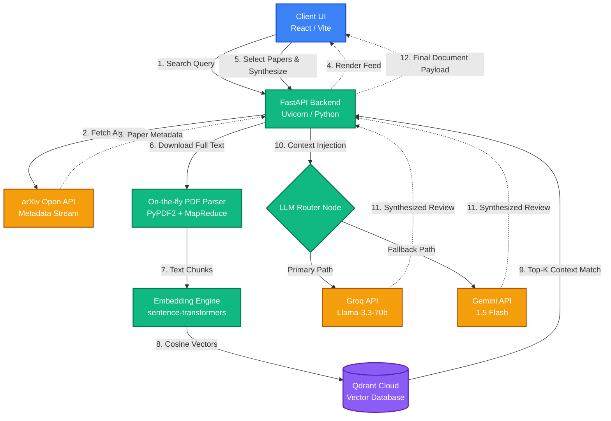

<div align="center">

# 🖧 OpenScholar

**Production-Grade Academic RAG & Literature Synthesis Engine**

[](https://github.com/anberaziz5/openscholar)
[](https://www.python.org/)
[](https://reactjs.org/)
[](https://fastapi.tiangolo.com/)
[](https://opensource.org/licenses/MIT)

<br />


<p align="center">
  <i>Query global repositories, ingest contextual vector embeddings, and construct verifiable literature synthesis models in real-time.</i>
</p>

</div>

---

## 📖 Overview

**OpenScholar** is an enterprise-level Retrieval-Augmented Generation (RAG) platform designed to eliminate the friction of academic research. Built on a serverless, dual-engine architecture, it allows researchers, engineers, and students to seamlessly search the live [arXiv](https://arxiv.org/) database, select full-text preprints, and generate citation-backed literature reviews on the fly.

Unlike standard wrappers, OpenScholar dynamically streams, chunks, and maps millions of vector embeddings into a high-dimensional intelligence graph, synthesizing contextual answers utilizing ultra-fast inference models.

## ✨ Enterprise Features

- ⚡ **Real-Time Live Streaming:** Instantly query over 2+ million academic papers directly from the arXiv API.
- 🧠 **Dynamic RAG Pipeline:** Automated PDF downloading, parsing, semantic chunking, and vector embedding generation (`all-MiniLM-L6-v2`) on demand.
- 🗄️ **High-Performance Vector Storage:** Seamless integration with Qdrant Cloud for ultra-low latency cosine-similarity searches.
- 🔄 **LLM Routing Engine:** Primary synthesis powered by **Groq (Llama-3.3-70b)** for lightning-fast inference, with automatic failover to **Google Gemini 1.5 Flash**.
- 🖥️ **Premium Asymmetrical UI:** A dual-pane, desktop-grade workspace built with React, Vite, and Tailwind CSS v4, mimicking top-tier enterprise SaaS environments.
- 🛡️ **Zero-Cost Scalable Architecture:** Designed entirely to run on free-tier, stateless cloud infrastructure (Render + Vercel + Cloudflare).

---

## 🏗️ System Architecture

OpenScholar utilizes a robust, decoupled architecture ensuring that PDF processing, vector mapping, and LLM inference do not block the user interface.



---

## 🛠️ Technology Stack

| Component | Technology | Role |
| --- | --- | --- |
| **Frontend Framework** | React 18, Vite | Client-side rendering & state management |
| **Styling & UI** | Tailwind CSS v4, Lucide | Enterprise-grade, utility-first UI |
| **Backend API** | FastAPI, Uvicorn | Asynchronous REST routing |
| **Vector DB** | Qdrant Cloud | High-dimensional dense vector storage |
| **Embeddings** | `sentence-transformers` | Semantic text encoding (`all-MiniLM-L6-v2`) |
| **Language Models** | Groq, Gemini | Natural Language Generation & Synthesis |
| **Document Processing** | `arxiv` API, `PyPDF2` | Live metadata retrieval & raw text extraction |

---

## 🚀 Quick Start & Local Setup

### Prerequisites

Before you begin, ensure you have active accounts and API keys for the following free services:

* [Qdrant Cloud](https://cloud.qdrant.io/) (Cluster URL & API Key)
* [Groq Console](https://console.groq.com/) (API Key)
* [Google AI Studio](https://aistudio.google.com/) (API Key)

### 1. Clone the Repository

```bash
git clone [https://github.com/anberaziz5/openscholar.git](https://github.com/anberaziz5/openscholar.git)
cd openscholar

```

### 2. Configure Backend

```bash
cd backend
python -m venv venv
source venv/bin/activate  # On Windows: venv\Scripts\activate
pip install -r requirements.txt

```

Create a `.env` file in the `backend/` directory:

```env
QDRANT_URL=your_qdrant_cluster_url
QDRANT_API_KEY=your_qdrant_api_key
GROQ_API_KEY=your_groq_api_key
GEMINI_API_KEY=your_gemini_api_key

```

Start the backend server:

```bash
uvicorn main:app --host 0.0.0.0 --port 8000 --reload

```

### 3. Configure Frontend

Open a new terminal tab:

```bash
cd frontend
npm install

```

Create a `.env` file in the `frontend/` directory:

```env
VITE_API_URL=http://localhost:8000

```

Start the Vite development server:

```bash
npm run dev

```

Navigate to `http://localhost:5173` in your browser.

---

## 📂 Project Structure

```text
openscholar/
├── backend/
│   ├── main.py                 # FastAPI application & route definitions
│   ├── requirements.txt        # Python dependencies
│   └── scripts/                # Utility scripts (legacy local processing)
├── frontend/
│   ├── src/
│   │   ├── App.jsx             # Main React Application & UI Logic
│   │   ├── index.css           # Tailwind v4 entrypoint
│   │   └── main.jsx            # React DOM rendering
│   ├── vite.config.js          # Vite & Tailwind configurations
│   ├── package.json            # Node dependencies
│   └── public/                 # Static assets
└── README.md

```

---

## ☁️ Deployment

OpenScholar is heavily optimized for zero-cost cloud deployment:

**Backend (Render Web Service)**

1. Connect the repository to Render.
2. Set root directory to `backend`.
3. Build command: `pip install -r requirements.txt`.
4. Start command: `uvicorn main:app --host 0.0.0.0 --port $PORT`.
5. Apply backend environment variables.

**Frontend (Vercel)**

1. Import repository to Vercel.
2. Set root directory to `frontend`.
3. Inject the `VITE_API_URL` environment variable pointing to your Render backend URL.
4. Deploy.

*(Note: Ensure your Render backend URL is added to the `allow_origins` array in `backend/main.py` to prevent CORS issues).*

---

## 🤝 Contributing

We welcome contributions from the open-source community!

1. Fork the Project
2. Create your Feature Branch (`git checkout -b feature/EnterpriseFeature`)
3. Commit your Changes (`git commit -m 'Add highly requested enterprise feature'`)
4. Push to the Branch (`git push origin feature/EnterpriseFeature`)
5. Open a Pull Request

---

## 📜 License

Distributed under the MIT License. See `LICENSE` for more information.